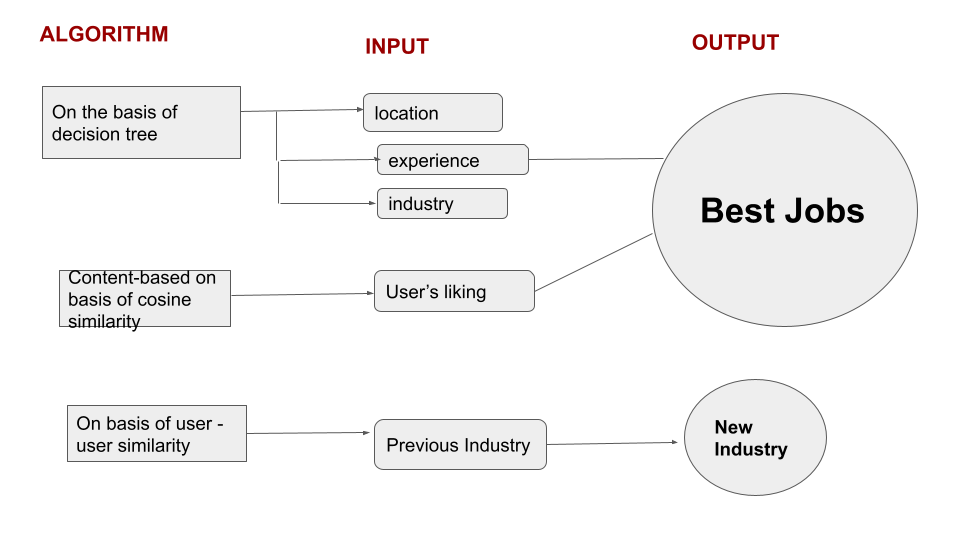

# Job-recommendation-system-engage

# 📖 JOBS RECOMMENDATION SYSTEM
### 🧐 Get the most suitable job for yourself!!

<!--  -->
<!--  -->
## 📋 Table of Contents
 ➡️   [Overview](#-overview)
 
 ➡️   [Tech Stack](#-tech-stack)
 
 ➡️   [How to run the project?](#-how-to-run-the-project?)
 
 ➡️   [Similarity Score](#-similarity-score)
 
 ➡️   [How Cosine Similarity works?](#-how-cosine-similarity-works?)
 
 ➡️   [Decision Tree Recommendation](#-decision-tree-recommendation) 
 
 ➡️   [Content Based Filtering](#-content-based-filtering) 
 
 ➡️   [Flowchart](#-flowchart) 
 
 ➡️   [Dependencies](#-dependencies)
 
 ➡️   [Data Source](#-data-source)
 

## 👩‍ Overview
It is a web-based application that suggests users the most suitable jobs for them.
It suggests jobs on basis of various criterias such as skills, education, experience,location etc.

## 👬 Features
1.Recommendations on basis of Location , Industry and Experience

2.Recommendations of jobs of similar types based on cosine similarity.

3.Want to change your industry?

4.Correlational Heatmaps

5.Interactive graph visualizations

6.Location-wise jobs

7.Company and sectors with highest no. of jobs 
etc.

<!-- Check out the live demo: https://mrswsa.herokuapp.com/ -->

Link to youtube demo: https://www.youtube.com/watch?v=qTLlDMXcD6Y

## 👩‍ How to run the project?

1. Clone or download this repository to your local machine.

2. Install all the libraries mentioned in the [Dependencies](#-dependencies)

3. Get the data from dataset folder in this [drive link](https://drive.google.com/drive/folders/1jGbHGVFk_FtySDhIKmZd1VjJdtfuq-bI?usp=sharing)

4. Open your terminal/command prompt from your project directory and run the file in virtual environment.
6. Type the command [streamlit run app.py]
7. Hurray! That's it.

##  Similarity Score 

   How does it decide which item is most similar to the item user likes? Here come the similarity scores.
   
   It is a numerical value ranges between zero to one which helps to determine how much two items are similar to each other on a scale of zero to one. This similarity score is obtained measuring the similarity between the text details of both of the items. So, similarity score is the measure of similarity between given text details of two items. This can be done by cosine-similarity.
   
##  How Cosine Similarity works?
  Cosine similarity is a metric used to measure how similar the documents are irrespective of their size. Mathematically, it measures the cosine of the angle between two vectors projected in a multi-dimensional space. The cosine similarity is advantageous because even if the two similar documents are far apart by the Euclidean distance (due to the size of the document), chances are they may still be oriented closer together. The smaller the angle, higher the cosine similarity.
  
  
  
 ##  Decision Tree Recommendation
  A decision tree is a type of supervised machine learning used to categorize or make predictions based on how a previous set of questions were answered. The model is a form of supervised learning, meaning that the model is trained and tested on a set of data that contains the desired categorization.
  
 ## Content Based Filtering
 Content-based filtering is a type of recommender system that attempts to guess what a user may like based on that user's activity. 
 
 ## Flowchart
 

 ##  Dependencies :  
  1.matplot.lib
  
  2.numpy
  
  3.pandas
  
  4.requests
  
  5.seaborn
  
  6.streamlit
  
  7.streamlit_option_menu
  
  8.wordcloud
##  Data source 
   Dataset is downloaded from naukri.com
   
  Get the entire data from this [link](https://drive.google.com/drive/folders/1jGbHGVFk_FtySDhIKmZd1VjJdtfuq-bI?usp=sharing)

